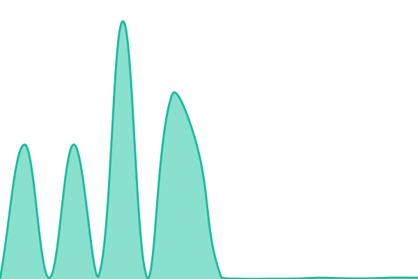

# [📈 Live Status](https://firstsun-dev.github.io/status-page): <!--live status--> **🟧 Partial outage**

This repository contains the open-source uptime monitor and status page for [firstsun-wenlu](https://firstsun.org/en), powered by [Upptime](https://github.com/upptime/upptime).

With [Upptime](https://upptime.js.org), you can get your own unlimited and free uptime monitor and status page, powered entirely by a GitHub repository. We use [Issues](https://github.com/firstsun-dev/status-page/issues) as incident reports, [Actions](https://github.com/firstsun-dev/status-page/actions) as uptime monitors, and [Pages](https://firstsun-dev.github.io/status-page) for the status page.

<!--start: status pages-->
<!-- This summary is generated by Upptime (https://github.com/upptime/upptime) -->
<!-- Do not edit this manually, your changes will be overwritten -->
<!-- prettier-ignore -->
| URL | Status | History | Response Time | Uptime |
| --- | ------ | ------- | ------------- | ------ |
|  [官網打卡](https://heavenfortress.com/member-system) | 🟨 Degraded | [member-system.yml](https://github.com/firstsun-dev/status-page/commits/HEAD/history/member-system.yml) | 

 7642ms
     
 | 

<a href="https://firstsun-dev.github.io/status-page/history/member-system">89.23%</a>
    

|  [id.heavenfortress.com](https://id.heavenfortress.com) | 🟩 Up | [id-heavenfortress-com.yml](https://github.com/firstsun-dev/status-page/commits/HEAD/history/id-heavenfortress-com.yml) | 

 109ms
     
 | 

<a href="https://firstsun-dev.github.io/status-page/history/id-heavenfortress-com">100.00%</a>
    

|  [checkin.heavenfortress.com](https://checkin.heavenfortress.com) | 🟩 Up | [checkin-heavenfortress-com.yml](https://github.com/firstsun-dev/status-page/commits/HEAD/history/checkin-heavenfortress-com.yml) | 

 93ms
     
 | 

<a href="https://firstsun-dev.github.io/status-page/history/checkin-heavenfortress-com">100.00%</a>
    

|  [Heavenweb host](114.32.31.90) | 🟥 Down | [heavenweb-host.yml](https://github.com/firstsun-dev/status-page/commits/HEAD/history/heavenweb-host.yml) | 

 181ms
     
 | 

<a href="https://firstsun-dev.github.io/status-page/history/heavenweb-host">91.67%</a>
    

|  [首陽問路](https://firstsun.heavenfortress.com) | 🟩 Up | [firstsun.yml](https://github.com/firstsun-dev/status-page/commits/HEAD/history/firstsun.yml) | 

 140ms
     
 | 

<a href="https://firstsun-dev.github.io/status-page/history/firstsun">100.00%</a>
    

|  [劈山問路](https://pmountain.heavenfortress.com) | 🟨 Degraded | [pmountain.yml](https://github.com/firstsun-dev/status-page/commits/HEAD/history/pmountain.yml) | 

 8543ms
     
 | 

<a href="https://firstsun-dev.github.io/status-page/history/pmountain">91.91%</a>
    

|  [小雨問路](https://rainsru.heavenfortress.com/) | 🟨 Degraded | [rainsru.yml](https://github.com/firstsun-dev/status-page/commits/HEAD/history/rainsru.yml) | 

 13769ms
     
 | 

<a href="https://firstsun-dev.github.io/status-page/history/rainsru">91.73%</a>
    

|  [烈陽問路](https://redcloud2810.heavenfortress.com/) | 🟨 Degraded | [redcloud.yml](https://github.com/firstsun-dev/status-page/commits/HEAD/history/redcloud.yml) | 

 8010ms
     
 | 

<a href="https://firstsun-dev.github.io/status-page/history/redcloud">94.27%</a>
    

<!--end: status pages-->

[**Visit our status website →**](https://firstsun-dev.github.io/status-page)

## 📄 License

- Powered by: [Upptime](https://github.com/upptime/upptime)
- Code: [MIT](./LICENSE) © [Anand Chowdhary](https://anandchowdhary.com)
- Data in the `./history` directory: [Open Database License](https://opendatacommons.org/licenses/odbl/1-0/)
